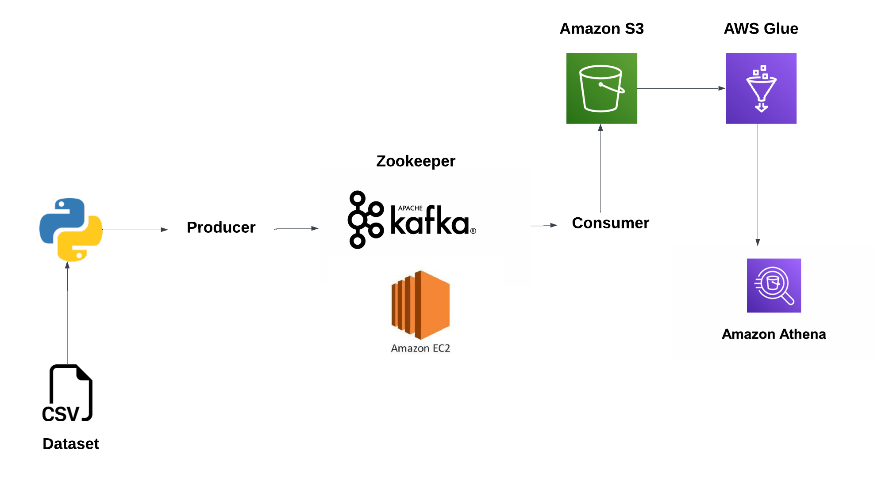

# Real-Time Stock Market Data Engineering with Kafka 📈

Welcome to the Real-Time Stock Market Data Processing project! 🌐 In this endeavor, you'll embark on an exciting journey of executing an End-To-End Data Engineering Project using various cutting-edge technologies, including Python, Amazon Web Services (AWS), Apache Kafka, Glue, Athena, and SQL. This project aims to get hands-on experience in handling real-time stock market data efficiently.

## Introduction

In this project, we will leverage the power of Apache Kafka to process real-time stock market data. The entire data engineering pipeline will be implemented using Python for scripting, AWS services for cloud infrastructure, and Apache Kafka for real-time data streaming.

## Architecture

The architecture of this project is designed to handle the intricacies of real-time stock market data processing. The key components include:

1. **Apache Kafka:** A distributed streaming platform for handling real-time data feeds efficiently.

2. **Python:** The programming language of choice for scripting and data processing tasks.

3. **Amazon Web Services (AWS):**
   - **S3 (Simple Storage Service):** Storage for raw and processed data.
   - **Athena:** Interactive query service for analyzing data directly in S3.
   - **Glue Crawler:** Used for discovering and cataloging metadata from raw data in S3.
   - **Glue Catalog:** A metadata repository for organizing and managing data in the AWS Glue Data Catalog.
   - **EC2:** Virtual machines for running specific tasks or services.

## Technology Used

### Programming Language
- **Python:** Utilized for scripting, data manipulation, and coordination of various components in the project.

### Amazon Web Service (AWS)
- **S3 (Simple Storage Service):** Used for storing raw and processed data, providing scalable and durable object storage.
- **Athena:** Enables ad-hoc querying of data in S3 using SQL queries.
- **Glue Crawler:** Discovers and catalogs metadata from raw data stored in S3.
- **Glue Catalog:** Acts as a centralized metadata repository for efficient data management.
- **EC2:** Virtual machines for running specific tasks or services in a scalable and flexible manner.

### Apache Kafka
- **Apache Kafka:** A distributed streaming platform that provides real-time event streaming, enabling efficient data processing.

## Contributing
If you'd like to contribute to this project, feel free to fork the repository, create a new branch, make your changes, and submit a pull request. Your contributions are highly appreciated!
